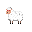

<!-- massive thank you to Othneildrew for the README template https://github.com/othneildrew/Best-README-Template-->

[![MIT License][license-shield]][license-url]

<!-- PROJECT LOGO -->
 

  

<h3 align="center">BARNYARD BLITZ</h3>

  

    Old MacDonald meets Mario Kart in this hilarious tour de force flash game.
     
    <a href="https://github.com/seamusmcm/comp225--24"><strong>Explore the docs »</strong></a>
     
     
  

<!-- TABLE OF CONTENTS -->

  
Table of Contents

  <ol>
    <li>
      <a href="#about-the-project">About The Project</a>
      <ul>
        <li><a href="#built-with">Built With</a></li>
      </ul>
    </li>
    <li>
      <a href="#getting-started">Getting Started</a>
      <ul>
        <li><a href="#installation">Installation</a></li>
      </ul>
    </li>
    <li><a href="#usage">Usage</a></li>
    <li><a href="#roadmap">Roadmap</a></li>
    <li><a href="#license">License</a></li>
    <li><a href="#contact">Contacts</a></li>
    <li><a href="#acknowledgments">Acknowledgments</a></li>
  </ol>

<!-- ABOUT THE PROJECT -->
## About The Project

[![Barnyard Blitz Screen Shot][product-screenshot]](https://example.com)

(<a href="#readme-top">back to top</a>)

### Built With

* [![Godot][Godot-url]][Godot.js]

### Hosted With

* 

(<a href="#readme-top">back to top</a>)

<!-- GETTING STARTED -->
## Getting Started

Our project is hosted with GitHub Pages. Access it [here](https://seamusmcm.github.io/comp225--24/) with any modern web browser. 

To get a local copy up and running follow these simple steps.

### Installation

1. Install [Godot engine.](https://godotengine.org/)

2. Clone [our repo.](https://github.com/SeamusMcM/comp225--24)
[![GitHub Screen Shot][clone-screenshot]](https://github.com/SeamusMcM/comp225--24)

3. Give our project a star.

4. Import your cloned repo into Godot engine and open it.
[![Godot Screen Shot][import-gd-sc.png]]()

5. Navigate to and open the `main.tscn` file in the bottom left and the click <kbd>Cmd</kbd> + <kbd>r</kbd> (Mac) or <kbd>F5</kbd> (PC)

(<a href="#readme-top">back to top</a>)

<!-- How To Play -->
## How To Play

Summary:
In this game there are two players racing to collect the most carrots, and to dodge the obstacles. Each player gains points for the carrot they eat as well as for the time they survive without hitting an obstacle. Hitting an obstacle ends that players run, though the other player can continue to play. The game ends when both players have hit an obstacle. The player with the most points wins.

Controls:
Player 1 (horse): <kbd>W</kbd> to move up, <kbd>A</kbd> to move left, <kbd>S</kbd> to move down, <kbd>D</kbd> to move right
Player 2 (sheep): <kbd>↑</kbd> to move up, <kbd>←</kbd> to move left, <kbd>↓</kbd> to move down, <kbd>→</kbd> to move right

(<a href="#readme-top">back to top</a>)

<!-- Creators -->
## Creators

<!-- LICENSE -->
## License

Distributed under the MIT License. See `LICENSE` for more information.

(<a href="#readme-top">back to top</a>)

<!-- CONTACTS -->
## Contacts
Armando Akapo-Nwagbo - <aakaponw@macalester.edu>\
Seamus McMurrer - <smcmurre@macalester.edu>\
Avery Sellers - <asellers@macalester.edu>\
Baituan Zhou - <bzhou@macalester.edu>

Project Link: [https://github.com/seamusmcm/comp225--24](https://github.com/seamusmcm/comp225--24)

(<a href="#readme-top">back to top</a>)

<!-- ACKNOWLEDGMENTS -->
## Acknowledgments

* GODOT tutorial (<https://docs.godotengine.org/en/stable/getting_started/first_2d_game/index.html>)
* Free Sound Effects (<https://soundbible.com/#google_vignette>)
* README Template (<https://github.com/othneildrew/Best-README-Template>)

(<a href="#readme-top">back to top</a>)

<!-- MARKDOWN LINKS & IMAGES -->
<!-- https://www.markdownguide.org/basic-syntax/#reference-style-links -->

[license-shield]: https://img.shields.io/github/license/seamusmcm/comp225--24.svg?style=for-the-badge
[license-url]: https://github.com/seamusmcm/comp225--24/blob/master/LICENSE.txt

[Godot-url]: https://img.shields.io/badge/Godot%20Engine-478CBF?logo=godotengine&logoColor=fff&style=flat
[Godot.js]: https://godotengine.org/

[product-screenshot]: misc/gameHome.png
[import-gd-sc.png]: misc/import.png
[clone-screenshot]: misc/clone.png