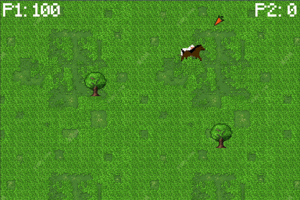

<!-- massive thank you to Othneildrew for the README template https://github.com/othneildrew/Best-README-Template-->

[![MIT License][license-shield]][license-url]

<!-- PROJECT LOGO -->
 

  

  <h3 align="center" style="font-family: 'Pacifico'; font-size: 24px; font-weight: bold;">BARNYARD BLITZ</h3>

  

    <em>"Old MacDonald meets Mario Kart in this hilarious tour de force flash game." </em> - Not IGN
     
    <em>"Best game since Pong." </em> - My mom
     
    <em>"I can't believe it's not butter." </em> - Confused but enthusiastic beta tester
     
    <a href="https://github.com/seamusmcm/comp225--24"><strong>Explore the docs »</strong></a>
     
     

<!-- ABOUT THE PROJECT -->
## About The Project

[![Barnyard Blitz Screen Shot][product-screenshot]](https://seamusmcm.github.io/comp225--24/)

(<a href="#readme-top">back to top</a>)

### Built With

* [![Godot][Godot-url]][Godot.js]

### Hosted With

* 

(<a href="#readme-top">back to top</a>)

<!-- GETTING STARTED -->
## Getting Started

Our project is hosted with GitHub Pages. Access it [here](https://seamusmcm.github.io/comp225--24/) with any modern web browser. 

To get a local copy up and running follow these simple steps.

### Installation

1. Install [Godot engine.](https://godotengine.org/)

2. Clone [our repo.](https://github.com/SeamusMcM/comp225--24)

[![GitHub Screen Shot][clone-screenshot]](https://github.com/SeamusMcM/comp225--24)

3. Give our project a star.

4. Import your cloned repo into Godot engine and open it.

[![Godot Screen Shot][import-gd-sc.png]]()

5. Navigate to and open the `main.tscn` file in the bottom left and the click <kbd>Cmd</kbd> + <kbd>r</kbd> (Mac) or <kbd>F5</kbd> (PC)

(<a href="#readme-top">back to top</a>)

<!-- HOW TO PLAY -->
## How To Play

### Summary:
In **_Barnyard Blitz_**, two players race to collect the most carrots while dodging obstacles.  

- Each player gains points for the carrots they eat and the time they survive without hitting an obstacle.  
- Hitting an obstacle ends that player's run, but the other player can continue playing.  
- The game ends when **both players** have hit an obstacle. <!-- - Be sure to keep an eye out for special items that can help you or hinder your opponent... -->
- Be sure to keep an eye out for the special shields that can protect you from obstacles!
- **The player with the most points wins!**

### Controls:
<!-- - **Start Game**: <kbd>Enter</kbd> -->
#### Player 1 (Horse):
- **Move Up**: <kbd>W</kbd>  
- **Move Left**: <kbd>A</kbd>  
- **Move Down**: <kbd>S</kbd>  
- **Move Right**: <kbd>D</kbd>
- **Power Up**: <kbd>Q</kbd>

#### Player 2 (Sheep):
- **Move Up**: <kbd>↑</kbd>  
- **Move Left**: <kbd>←</kbd>  
- **Move Down**: <kbd>↓</kbd>  
- **Move Right**: <kbd>→</kbd>
- **Power Up**: <kbd>/</kbd>

### Gameplay:

(<a href="#readme-top">back to top</a>)

## Known Bugs
- Esc pause menu is inconsistant in functionality - often causing the need to reload the webpage
- Horse's hitbox is larger than sheep's
<!-- Creators -->
## Creators

<!-- LICENSE -->
## License

Distributed under the MIT License. See `LICENSE` for more information.

(<a href="#readme-top">back to top</a>)

<!-- CONTACTS -->
## Contacts
Armando Akapo-Nwagbo - <aakaponw@macalester.edu>\
Seamus McMurrer - <smcmurre@macalester.edu>\
Avery Sellers - <asellers@macalester.edu>\
Baituan Zhou - <bzhou@macalester.edu>

Project Link: [https://github.com/seamusmcm/comp225--24](https://github.com/seamusmcm/comp225--24)

(<a href="#readme-top">back to top</a>)

<!-- ACKNOWLEDGMENTS -->
## Acknowledgments

* [GODOT tutorial](<https://docs.godotengine.org/en/stable/getting_started/first_2d_game/index.html>)
* [Free Sound Effects](<https://soundbible.com/#google_vignette>)
* [README Template](<https://github.com/othneildrew/Best-README-Template>)
* "Grass Pixel Art Textures", by txturs on [Deviantart](https://www.deviantart.com/txturs/art/Grass-Pixel-Art-Textures-512954148), licensed under CC BY 3.0

(<a href="#readme-top">back to top</a>)

<!-- MARKDOWN LINKS & IMAGES -->
<!-- https://www.markdownguide.org/basic-syntax/#reference-style-links -->

[license-shield]: https://img.shields.io/github/license/seamusmcm/comp225--24.svg?style=for-the-badge
[license-url]: https://github.com/seamusmcm/comp225--24/blob/Old_File_Structure/LICENSE

[Godot-url]: https://img.shields.io/badge/Godot%20Engine-478CBF?logo=godotengine&logoColor=fff&style=flat
[Godot.js]: https://godotengine.org/

[product-screenshot]: misc/gameHome.png
[import-gd-sc.png]: misc/import.png
[clone-screenshot]: misc/clone.png
